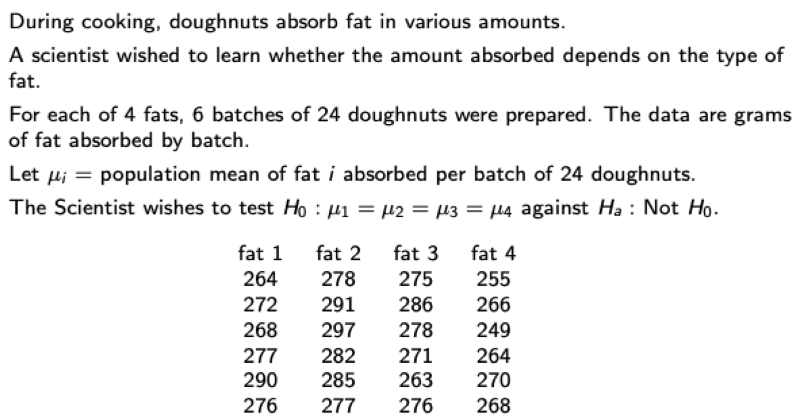

# Part1. Script in Slides CRD
## Example 1


### **Preliminary Exploratory Data Analysis (EDA)**

A preliminary eploratory/graphical analysis of the data prior to any formal modeling, testing or estimation.
Include:<br>
* **Simple descriptive statistics**, eg: means, medians, standard errors, interquartile ranges -> <span style="color:blue">summary()</span>
```{r}
fat = c(rep("fat1",6),rep("fat2",6),rep("fat3",6),rep("fat4",6))
amount = c(264,272,268,277,290,276,278,291,297,282,285,277,275,286,278,271,263,276,255,266,248,264,270,268)
data = data.frame(fat,amount)
summary(data[,2][data[,1]=='fat1'])
summary(data[,2][data[,1]=='fat2'])
summary(data[,2][data[,1]=='fat3'])
summary(data[,2][data[,1]=='fat4'])
```

* Plots, eg: 
1) stem and leaf diagrams -> <span style="color:blue">stem()</span>
#Classifies data items according to their most significant numeric digits.
Not suitable here.
```{r}
stem(data[,2][data[,1]=='fat4'])
```
2) box-plots-> <span style="color:blue">boxplot(data)</span>
#The bars are min and max, lower and upper edges of box are 1st and 3rd quantile, thick line is median.
```{r}
boxplot(data[,2]~data[,1])
```
3) scatter-plots -> <span style="color:blue">plot()</span> <br>
plot(x,y). Here we don't have numerical xs, so the plot(data[,1], data[,2]) would be boxplot().
```{r}
plot(data[,1], data[,2])
```


```{r}
fit = lm(data[,2]~data[,1])
summary(fit)
```

### Build a model.
1. Linear regression
```{r}
summary(lm(data[,2]~data[,1]))
```

```{r}
fit = lm(data[,2]~factor(data[,1]))
summary(fit)
```
<span style="color:red">This is the same with Reference cell method in the last two pages of slides. $\mu^* \equiv \mu_1$ (reference cell) and $\alpha_i^* \equiv \mu_i - \mu^*$</span> <br>

2. Factor Model Formulation
```{r}
a = factor(data[,1])
a
summary(lm(data[,2]~a, contrasts = list(a="contr.sum")))
```
The fitted model is $\hat{Y_{ij}} = Intercept + \hat{\alpha_i}$ where $\alpha_4 = -\alpha_1 - \alpha_2 - \alpha_3$.
Using constraints $\sum\limits_{i=1}^k \alpha_i = 0$.
```{r}
list(a="contr.sum")
```

