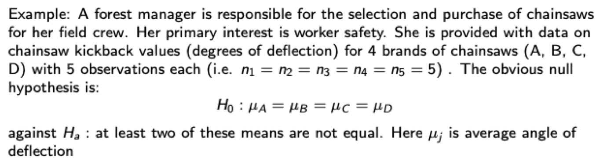
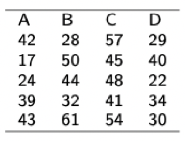

u---
title: "Lec4"
output: html_notebook
---

# 1. Slides: Multiple Comparisons and Constraints
**Data Preparation**
```{r}
#prepare data
fat = c(rep("fat1",6),rep("fat2",6),rep("fat3",6),rep("fat4",6))
amount = c(264,272,268,277,290,276,278,291,297,282,285,277,275,286,278,271,263,276,255,266,248,264,270,268)
data = data.frame(fat,amount)
```
## 1.1 LSD & Bonferroni Method
Perform multiple comparisons in terms of p-values for all pairwise two sample t-tests.

<span style="color:blue">pool.sd=TRUE</span>
 means using the pooled standard deviation from the ANOVA.
 
<span style="color:blue">p.adjust.method="none"</span> defines the p-value adjustment method, could be set to "none", "bonferroni", etc.

<span style="color:blue">If the result is smaller than required p-value (like 0.05), we say it exceeds LSD.</span> <br>
Eg, in the following result, (fat1, fat2) = 0.04 < 0.05, exceeds LSD.
From the table, there are three groups {4}, {1, 3} and {2}
```{r}
pairwise.t.test(data[,2],data[,1],pool.sd=TRUE,p.adjust.method="none")
```
```{r}
data[,2]
```

```{r}
pairwise.t.test(data[,2],data[,1],pool.sd=TRUE,p.adjust.method="bonf") #bonferroni
```

## 1.2 Linear contrast


```{r}
y = c(42,28,57,29,17,50,45,40,24,44,48,22,39,32,41,34,43,61,54,30)
c1 = c(rep(c(1,-1,-1,1),5))
#c(rep(1,5),rep(-1,5),rep(-1,5),rep(1,5)) = rep(c(1,-1,-1,1),each=5)
anova(lm(y~c1))

```


## Two tests weren't covered in class
### Tukey's method
```{r}
fit = aov(data[,2]~data[,1])
TukeyHSD(fit)
```
### Kruskal-Wallis test
```{r}
kruskal.test(data[,2]~data[,1])
```

# 2. HW
Linear contrast could be calculated by fit.contrast directly. 
But Professor wants us to calculate by hand.
See following self-defined functions having the same CI with fit.contrast.
$L=\mu_1 - \mu_2$
```{r}
library(gdata)
data = read.xls("~/Desktop/4291-AdvancedDA/HW/HW2/HW2(Diets).xlsx", header=TRUE)
CI_Bonf = function(yi, yj, MSE, n, k, g){
  Lhat = mean(yi) - mean(yj)
  t = qt(1-0.05/(2*g), n-k)
  SEL = sqrt(MSE * (1/length(yi) + 1/length(yj)))
  dev = t  * SEL
  print(dev)
  print(Lhat)
  return(c(Lhat-dev, Lhat+dev))
}

CI_Bonf(data[,2][data[,1]==1], data[,2][data[,1]==2],0.039096,29,4,1)
library(gmodels)
fit.contrast(lm(data[,2]~factor(data[,1])), factor(data[,1]), c(1,-1,0,0), conf=0.95)
```


